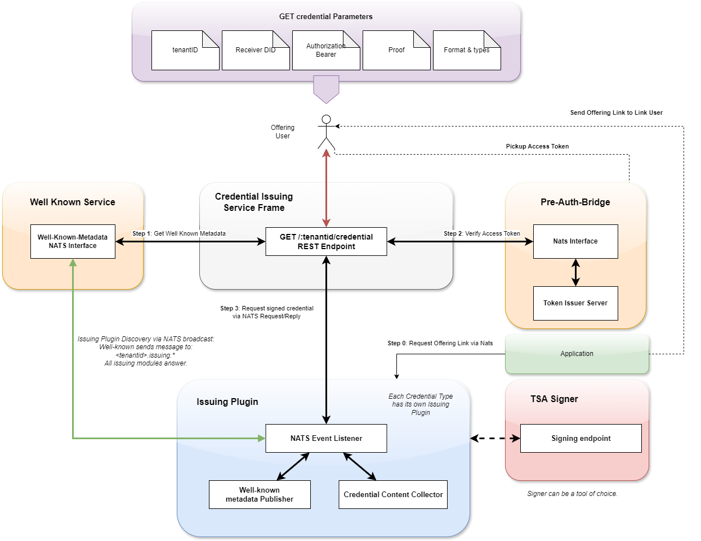
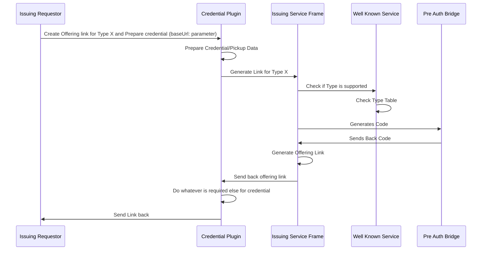
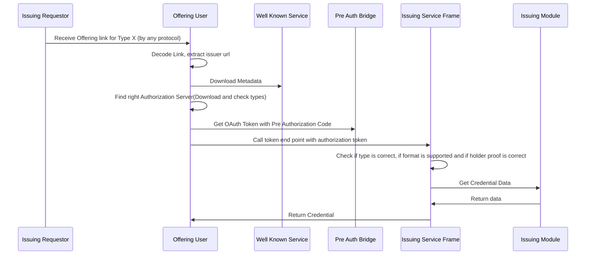
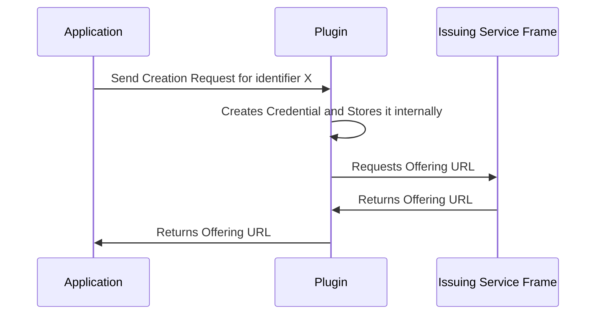
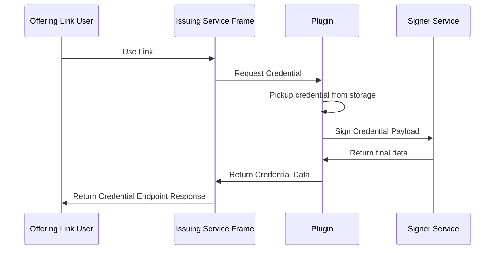

# Introduction

The issuing service frame is a encapsulation for the OID4VC [issuing endpoint](https://openid.github.io/OpenID4VCI/openid-4-verifiable-credential-issuance-wg-draft.html#name-credential-offer) (batch is currently not supported). This endpoints are encapsulated because each credential has an different kind of creation flow/preperation, which should not be hardcoded in the issuing protocol itself to avoid oid standard breaks. For this purpose the component was designed to just provide the flow essentials, but no credential handling as such. Main purpose behind that is, that a issuing service frame can run in the cluster without any knowledge about the credentials, which means other credential types can be added dynamically later without any need to modify the issuing frame itself. 

Note: The implementation of the OID protocol is a early state of february. There is currently no TX_Code in it, and the PIN still used. (waiting for the final release of the OID workgroup)

# Flows

## Step 1: Create the offering link

The offering link is just a description where to pickup the credential and how to pickup the authorization for it. After creating the offering link by the issuing requestor (mostly an application), the credential must be sent to the user of the link.  

## Step 2: Use the Offering link

The usage of the offering link contains serveral steps. Find the right oauth server, obtaining the token with the preauth code and pickup the credential data. 

# Depedencies

- Pre Auth Bridge
- Well Known Service

The issuing service frame can work without any issuing module, but returns then just errors.

# Bootstrap

For installing the helm chart use helm install in the kubernetes cluster. Modify the ingress settings to the proper domains in your cluster and set the audience and jwks urls to the urls which you are using. 

Well Known and Pre Auth must be available.

# Developer Information

## Plugin Development

### Overview

To develop a issuing plugin, the issuing service frame must not be touched or redeployed, but the plugin must be designed as seperate micro service with some well defined capabilities. It's doesnt matter whether the plugin has external endpoints, or just internal one, or whether the plugin has some special logic or not. The plugin is free in his "life cycle" and functionality. Just the main interfaces must be fullfilled to integrate in the issuing service frame.  

#### Creation Flow:

Note: Creation means here, that the credential data is collected and the credentials is prepared for issuance. The signing should not yet happen here, because its not guaranteed that the credential offering link is really used by the link user. 

#### Issuance Flow: 

#### Well Known Data Distribution:

The well known data publication is an [event](https://gitlab.eclipse.org/eclipse/xfsc/organisational-credential-manager-w-stack/credential-issuance/modules/dummycontentsigner/-/blob/main/metadata/registration.go?ref_type=heads#L184) which tells the well known service that a credential issuance is available. It should be sent from time to time, that the well known service knows that is available. The data format is described by the oid4vc [spec](https://openid.github.io/OpenID4VCI/openid-4-verifiable-credential-issuance-wg-draft.html#section-11.2.3)

### Storage

The plugin should have an internal storage which keeps track about requested credentials. This can be a stupid in memory cache or a database. You see in the dummy content signer an [example](https://gitlab.eclipse.org/eclipse/xfsc/organisational-credential-manager-w-stack/credential-issuance/modules/dummycontentsigner/-/raw/main/issuance/credentialStorage.go?ref_type=heads) how this can look like. Import is just that the credential is identifiable by the credential reuqest by choosing a unique id during the auth request against the issuance frame. 

### NATS Interfaces

### Create Credential

The create credential interface must be replied by nats [message](https://github.com/eclipse-xfsc/nats-message-library/-/blob/main/issuance.go?ref_type=heads#L12) like in this [example](https://gitlab.eclipse.org/eclipse/xfsc/organisational-credential-manager-w-stack/credential-issuance/modules/dummycontentsigner/-/blob/main/issuance/credentialRequest.go?ref_type=heads#L64)

The application will request on this subject the offering link (which is forwared to somewhere)

### Issue Credential

The issuance nats [message](https://github.com/eclipse-xfsc/oid4-vci-issuer-service/-/blob/main/pkg/messaging/types.go?ref_type=heads#L55) requests the issuance of the prepared credential. During this request the credential data must be picked up in the right format and signed. The variant of signing is up to the plugin. The dummy content signer uses the TSA signer service. You can see here an [example](https://gitlab.eclipse.org/eclipse/xfsc/organisational-credential-manager-w-stack/credential-issuance/modules/dummycontentsigner/-/blob/main/issuance/credentialReply.go?ref_type=heads#L62)

